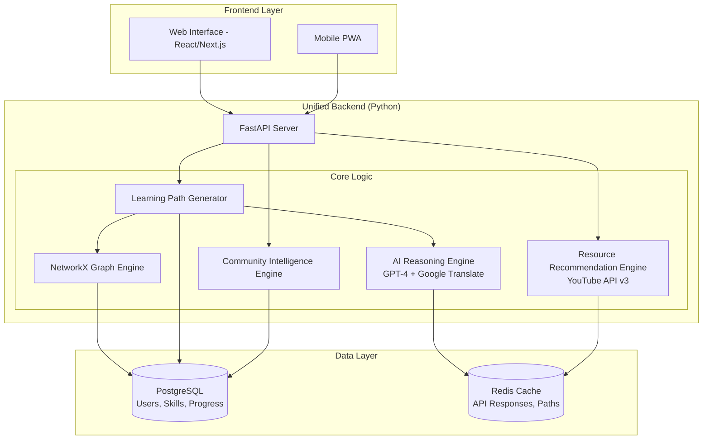
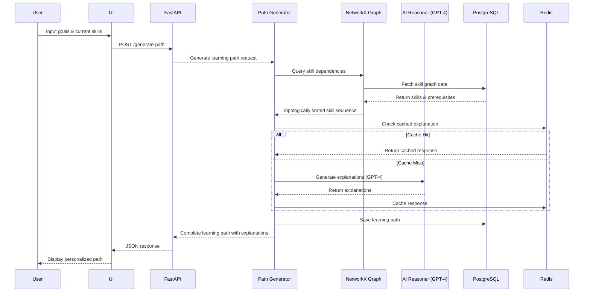

# Design Document: SkillScout

## Overview

SkillScout is an AI-powered learning guidance platform that addresses the critical challenge of learning direction for Indian learners. The system uses intelligent reasoning over skill dependencies to generate personalized learning paths, explain concept importance, and identify prerequisite gaps.

### Core Value Proposition
- **Intelligent Guidance**: AI-driven recommendations based on skill dependency analysis
- **Explainable Learning**: Clear reasoning for why each learning step is necessary
- **Community Intelligence**: Learning from collective user patterns and feedback
- **Accessibility First**: Designed for diverse Indian learners with varying backgrounds

### Key Design Principles
1. **AI-Powered Reasoning**: Every recommendation backed by explainable logic
2. **Incremental Learning**: Build knowledge systematically through prerequisite chains
3. **Community Learning**: Leverage collective intelligence while protecting privacy
4. **Inclusive Design**: Accessible across languages, devices, and skill levels
5. **Prototype Scalability**: Demonstrate core concepts with future expansion potential

## Technology Stack (Prototype-Oriented)

### Frontend Layer
- **Web Interface**: React/Next.js for responsive web application
- **Mobile Support**: Progressive Web App (PWA) for mobile accessibility
- **Multilingual**: i18n support for Hindi and English
- **Low-Bandwidth Optimization**: Lightweight assets, lazy loading, offline-first approach
- **UI Framework**: Tailwind CSS for rapid, accessible interface development

### Backend Layer
- **API Framework**: **FastAPI (Python)**. Consolidating the backend in Python allows for native integration with **NetworkX** for graph logic and **Bhashini's** Python SDKs, reducing architectural overhead.
- **Modular Services**: Modular service-oriented backend for clear separation of concerns
- **Authentication**: JWT-based auth with secure session management
- **API Design**: GraphQL or REST for flexible data querying

### AI & Intelligence Layer
- **LLM Integration**: OpenAI GPT-4 API for path generation and explanations
- **Graph Database**: NetworkX (Python) for skill dependency analysis
- **Reasoning Engine**: Custom Python logic for skill analysis and path generation
- **Multilingual Engine**: **Bhashini Udyat APIs** for high-fidelity translation and transliteration (Indic-to-Indic and English-to-Indic).
- **Caching**: Redis for API response caching
- **Pattern Recognition**: Simple ML models for community learning pattern analysis

### Data Layer
- **Database**: PostgreSQL for all data (profiles, skills, progress)
- **Caching**: Redis for caching
- **Resource Metadata**: JSON-based storage for learning resource information

### Infrastructure (Hackathon-Friendly)
- **Deployment**: Vercel/Netlify (frontend) + Railway/Render (backend)
- **Database Hosting**: Supabase, PlanetScale, or MongoDB Atlas free tiers
- **AI Services**: OpenAI API or Hugging Face Inference API
- **Monitoring**: Simple logging with Sentry for error tracking
- **Version Control**: GitHub with CI/CD via GitHub Actions

### Why This Stack

**Rapid Development**: Modern frameworks enable quick prototyping
**Cost-Effective**: Generous free tiers for hackathon deployment
**Scalable Foundation**: Architecture supports future growth
**AI-Ready**: Easy integration with LLM and ML services
**Accessible**: Works on low-end devices with limited connectivity

## Architecture

### High-Level System Architecture

This architecture uses a unified FastAPI backend to minimize network hops and latency, which is critical for meeting the 3-second response target specified in the requirements.



**Key Architectural Decisions**:

- **Unified Backend**: FastAPI serves as the single entry point, eliminating gateway overhead and reducing latency
- **Topological Sorting**: The NetworkX Graph Engine uses topological sorting algorithms to ensure learning paths are logically ordered with prerequisites appearing before dependent skills
- **Intelligent Caching**: Redis caches GPT-4 responses and YouTube API results to optimize costs and response times
- **Direct Integration**: All components run within the same Python process, enabling fast in-memory communication

### Component Interaction Flow



**Flow Highlights**:

- **Cache-First Strategy**: Redis is checked before making expensive GPT-4 API calls
- **Graph-Based Ordering**: NetworkX ensures prerequisite dependencies are respected through topological sorting
- **Single Round-Trip**: Frontend makes one API call; backend orchestrates all internal operations
- **Persistent Storage**: PostgreSQL stores user progress and skill graph for consistency

## Components and Interfaces

### 1. AI Reasoner (Core Intelligence)

The central AI system that performs skill dependency analysis and generates learning recommendations.

**Key Capabilities**:
- Analyzes skill prerequisites and dependencies using graph traversal algorithms
- Identifies learning gaps by comparing current skills against target requirements
- Generates explainable recommendations with clear reasoning chains
- Incorporates community learning patterns to improve suggestion quality

**Example Interface**:
```typescript
interface AIReasoner {
  analyzeSkillPath(currentSkills, targetSkills, learnerContext): SkillAnalysis
  generateExplanation(recommendation, context): Explanation
  identifyPrerequisiteGaps(targetSkill, currentSkills): PrerequisiteGap[]
}
```

### 2. Learning Path Generator

Orchestrates the creation of personalized learning sequences based on AI reasoning.

**Key Capabilities**:
- Generates step-by-step learning paths with estimated timelines
- Sequences skills based on dependency constraints
- Integrates resource recommendations from curated sources
- Adapts paths dynamically based on learner progress and feedback

### 3. Skill Dependency Analyzer

Manages the skill graph database and queries concept relationships.

**Key Capabilities**:
- Maintains a graph structure of technology skills and their prerequisites
- Performs efficient dependency queries and pathfinding
- Updates skill connections based on community learning data
- Provides skill metadata including difficulty, time estimates, and applications

### 4. Community Intelligence Engine

Analyzes anonymized community learning patterns to improve recommendations.

**Key Capabilities**:
- Collects privacy-preserving learning signals (no PII)
- Identifies successful learning sequences and common challenges
- Detects patterns in how similar learners progress
- Provides community-driven insights while protecting individual privacy

### 5. Explanation Engine

Generates clear, contextual explanations for AI recommendations.

**Key Capabilities**:
- Converts AI reasoning into human-readable explanations
- Adapts language complexity based on learner background
- Supports Hindi and English with culturally relevant examples
- Explains "why" each learning step matters for career goals

### 6. Resource Recommendation Engine

Integrates YouTube Data API v3 for video discovery. Filters by language (Hindi/English), views (>10k), likes (>90%), recency (<2 years). Returns 1 primary resource + 2-3 videos per skill. Caches popular queries in Redis.

## Data Bootstrapping Strategy

Initial skill graph: 50-100 manually curated skills for 5 career paths (Frontend, Backend, Data Science, DevOps, Mobile). Community data seeded with 20-30 synthetic learner journeys showing realistic timelines and common challenges (e.g., "87% found closures difficult").

## Data Models

### Core Entities

**Learner Profile**:
- Current skills and proficiency levels
- Learning goals and career aspirations
- Background (education, experience, language preference)
- Learning preferences and pace
- Progress tracking data

**Skill**:
- Unique identifier and name
- Category (e.g., programming, frameworks, tools)
- Difficulty level and estimated learning time
- Prerequisites (other skill IDs)
- Real-world applications and career relevance
- Associated learning resources

**Learning Path**:
- Ordered sequence of learning steps
- Explanations for each step
- Estimated total duration
- Adaptation history
- Progress checkpoints

**Learning Step**:
- Target skill to learn
- Why it's important (explanation)
- Recommended resources
- Prerequisites that must be completed first
- Estimated time investment

**Community Signal** (Anonymized):
- Skill sequence attempted
- Time spent and success indicators
- Difficulty ratings
- Learner type (generalized, no PII)
- Timestamp for trend analysis

## Correctness Properties

*A property is a characteristic or behavior that should hold true across all valid executions of a system—essentially, a formal statement about what the system should do. Properties serve as the bridge between human-readable specifications and machine-verifiable correctness guarantees.*
## AI Intelligence & Explainability

### How the AI Reasoner Works

**Skill Dependency Analysis**:
The system maintains a directed graph where nodes represent skills and edges represent prerequisite relationships. When a learner specifies a goal, the AI performs graph traversal to identify:
- All prerequisite skills needed to reach the goal
- Missing skills in the learner's current profile (gaps)
- Optimal learning sequence that respects dependencies

**Gap Prioritization Logic**:
When multiple prerequisite gaps exist, the AI prioritizes based on:
1. **Blocking Impact**: How many target skills are blocked by this gap
2. **Learning Efficiency**: Estimated time to fill the gap vs. value unlocked
3. **Community Success**: How often learners who filled this gap succeeded
4. **Career Relevance**: Alignment with learner's stated career goals

**Explanation Generation**:
For each recommendation, the AI generates explanations by:
- Tracing the reasoning chain from current state to goal
- Identifying practical applications of the skill
- Connecting the skill to career opportunities
- Using community data to provide realistic expectations

**Community Pattern Integration**:
The system learns from anonymized community data:
- Identifies skill sequences with high success rates
- Detects common learning challenges and suggests preventive resources
- Adjusts time estimates based on actual learner experiences
- Recommends resources that worked well for similar learners

### Why This Matters for Indian Learners

**Addresses Real Pain Points**:
- Prevents wasted time on advanced topics without prerequisites
- Reduces frustration from unclear learning direction
- Builds confidence through systematic skill building
- Provides motivation through clear career connections

**Culturally Relevant**:
- Explanations adapted for varying English proficiency
- Hindi language support for core interactions
- Examples relevant to Indian job market and companies
- Considers constraints like limited internet and device access

## Error Handling & Reliability

### Graceful Degradation Strategy

**When AI Reasoning Fails**:
- Fall back to rule-based recommendations using skill categories
- Provide basic sequential learning paths
- Offer manual skill selection with warnings about prerequisites

**When Community Data is Unavailable**:
- Use individual learner data and skill graph only
- Provide conservative time estimates
- Rely on curated expert recommendations

**When Skill Graph Has Gaps**:
- Identify and flag incomplete dependency information
- Suggest related skills that may fill the gap
- Allow learners to proceed with informed warnings

**Input Validation**:
- Handle incomplete learner profiles gracefully
- Provide guided profile completion for better results
- Offer reasonable defaults when information is missing

### Data Privacy & Security

**Anonymization Approach**:
- Community signals store only skill IDs and aggregated metrics
- No personally identifiable information in shared data
- Individual learning data encrypted and isolated
- Learners control what data contributes to community insights

## Validation & Quality Assurance

### Testing Approach

**Core Functionality Validation**:
- Verify learning path generation produces valid, dependency-respecting sequences
- Test prerequisite gap detection across diverse skill combinations
- Validate explanation quality and completeness
- Ensure community pattern integration improves recommendations

**AI Quality Metrics**:
- **Path Correctness**: Generated paths respect all skill dependencies
- **Explanation Clarity**: Recommendations include actionable reasoning
- **Adaptation Effectiveness**: System responds appropriately to feedback
- **Privacy Preservation**: Community data contains no PII

**User Experience Testing**:
- Test with diverse learner profiles (varying backgrounds, goals, skill levels)
- Validate multilingual support (Hindi/English)
- Ensure mobile responsiveness for common Indian devices
- Verify accessibility for users with varying technical literacy

**Data Integrity**:
- Skill graph consistency checks (no circular dependencies)
- Progress tracking accuracy validation
- Community signal anonymization verification
- Resource recommendation relevance testing

### Success Criteria

The prototype successfully demonstrates:
1. **Intelligent Guidance**: AI generates personalized, explainable learning paths
2. **Gap Detection**: System identifies and prioritizes missing prerequisites
3. **Community Learning**: Anonymized patterns improve recommendations
4. **Accessibility**: Works across languages and device types
5. **Adaptability**: Responds to user feedback and goal changes

This validation strategy ensures SkillScout delivers meaningful AI-driven learning guidance while maintaining quality, privacy, and accessibility standards appropriate for a hackathon prototype.